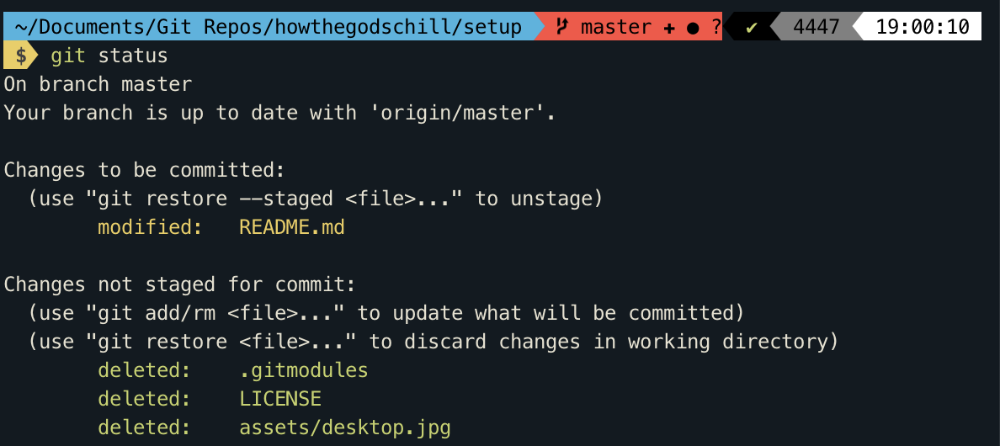
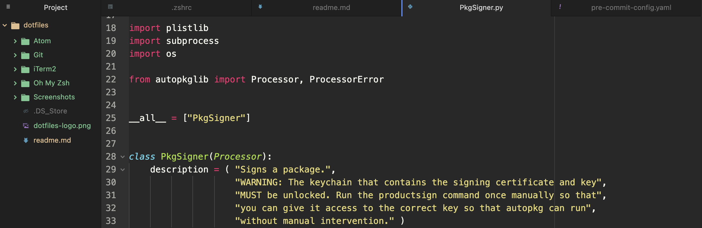

# My Mac Setup

Documenting my system for reinstalls in case of crash or replacement


How to use: Open an issue each time I need to setup a new machine, paste [the checklist](https://github.com/howthegodschill/setup/blob/main/checklist.md) from this readme, and follow the steps.

## Contents

```bash
setup/
│  ├─ assets/
│  │  ├─ theme-atom.png
│  │  ├─ theme-clovis.png
│  │  └─ theme-iterm.png
│  │
│  └─ dotfiles/
│     ├─ Atom/
│     ├─ Git/
│     ├─ iTerm2/
│     ├─ Oh My Zsh/
│     ├─ Screenshots/
│     ├─ dotfiles-logo.png
│     └─ README.md
│
├─ CHECKLIST.md
└─ README.md
```

## Contents

| File | Description |
| --- | --- |
| `CHECKLIST.md` | The template list of stuff to do. Open a new issue, and get going! :sparkles: |
| `.gitconfig` | Global Git configuration to specify my name, email, colors, etc. |
| `.gitignore_global` | My global Git ignore file |
| `.zshrc` | Config file for ZSH with aliases, theme, and some other stuff |

## Themes

### iTerm2 theme:



### Atom theme:



## Thanks
- Inspiration from [Mina's](https://github.com/minamarkham/setup) and [Joel's](https://github.com/jglovier/my-setup) setup repos
